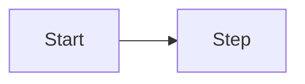

# Functional requirements — template

> Primary language: **English**. After each section, add **PT —** companion text for Portuguese readers.  
> **PT —** Língua principal: **inglês**. Depois de cada secção, bloco **PT —** para leitores em português.

## Document control

| Field | Value |
|-------|--------|
| Product / service | |
| Version | |
| Author | |
| Reviewers | |
| Last updated | |

## 1. Goals and scope

- **In scope:** …
- **Out of scope:** …

**PT —** Objetivos e limites: o que entra e o que fica de fora para evitar desalinhamento.

## 2. Personas and stakeholders

| Persona | Goal | Pain today |
|---------|------|------------|
| | | |

**PT —** Quem usa o sistema e o que precisam alcançar.

## 3. Functional capabilities

### FR-001 — [Capability name]

- **User story:** As a … I want … so that …
- **Acceptance criteria (Given / When / Then):**
  1. …
  2. …
- **Edge cases:** …
- **Dependencies:** …

*(Repeat FR-00x for each capability.)*

**PT —** Cada requisito funcional com história de utilizador e critérios de aceitação testáveis.

## 4. User journeys (optional)

Mermaid or bullet flow:

**PT —** Fluxos principais para alinhar produto, UX e engenharia.

## 5. Open questions

| ID | Question | Owner | Due |
|----|----------|-------|-----|
| Q1 | | | |

**PT —** Dúvidas explícitas; não esconder incerteza.
