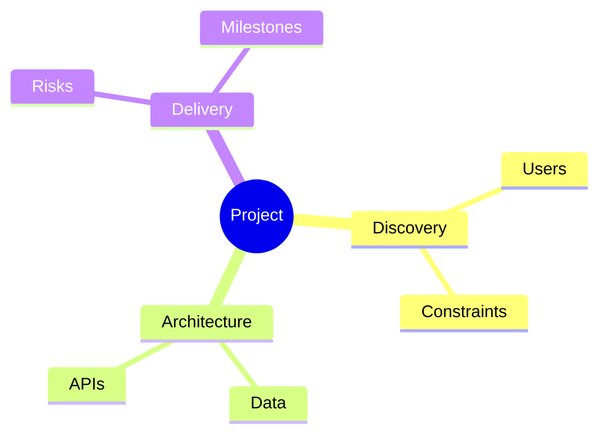

# Mind map — conceptual outline + Mermaid (template)

> Use for product/tech discovery: themes, risks, dependencies. English body + **PT —** per section.  
> **PT —** Mapa mental para discovery: temas, riscos, dependências. Corpo em inglês + blocos PT.

## Central theme

**[Project or feature name]**

**PT —** Tema central (projeto ou funcionalidade).

## Branches (outline)

### Branch A — [Area]

- Sub-topic A1
- Sub-topic A2

### Branch B — [Area]

- …

**PT —** Ramos principais e subtópicos em prosa.

## Mermaid mindmap (optional)

Paste into any Markdown preview that supports Mermaid `mindmap`:

**PT —** O diagrama Mermaid é opcional; útil para apresentações. Se o renderizador não suportar, mantém só o outline em lista.

## How this ties to other docs

- Link themes to **FRs** in `functional-requirements.md`
- Link risks to **NFRs** or `security-review.md`
- Link milestones to **Linear** or `page-map.md`

**PT —** Liga o mapa mental a FRs, NFRs, segurança e roadmap.
